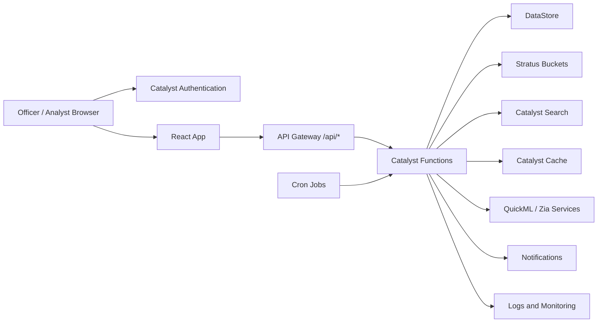
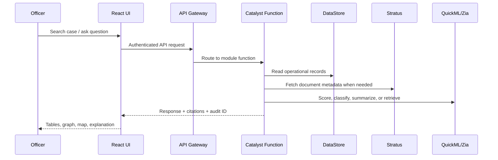
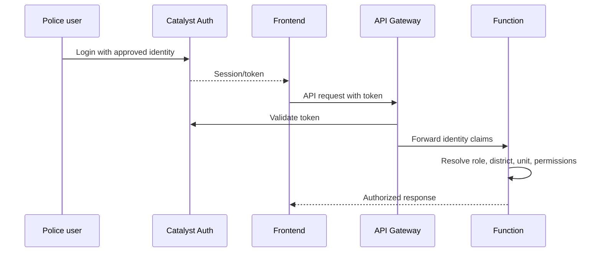

# Crime Intelligence and Investigation Platform - Production Architecture

This document designs a deployable Zoho Catalyst based intelligence platform for Karnataka State Police. It intentionally stays at architecture level: no implementation code, but enough structure for console setup, team division, endpoint planning, deployment, and judge demonstration.

## 1. Overall System Architecture

### Frontend Architecture

- React + TypeScript + Vite single page application deployed through Catalyst AppSail or Catalyst Web Client Hosting.
- Feature-first modules: dashboard, cases, persons, organizations, analytics, crime map, network graph, chatbot, documents, court, bond, administration.
- API client layer centralizes authentication headers, retry policy, request IDs, pagination, and error handling.
- State is split into server state, short-lived UI state, and secure user/session state.
- Map, graph, and analytics views consume normalized API responses, not direct DataStore rows.

### Backend Architecture

- Catalyst Advanced I/O Functions expose REST endpoints behind API Gateway.
- Backend modules map to investigation domains: cases, person, organization, analytics, chat, legal, arrest, bond, court, documents, notifications, administration.
- Shared backend packages provide Catalyst SDK access, auth enforcement, validation, audit logging, error mapping, cache, and response envelopes.
- DataStore remains the operational source of truth; Stratus stores binary evidence and documents.

### Catalyst Architecture



### AI Architecture

- SQL Agent: converts officer questions into safe, approved query plans over DataStore.
- RAG Agent: retrieves FIRs, chargesheets, court orders, statements, notes, and evidence metadata from Stratus/Search.
- Analytics Agent: explains dashboards, hotspots, charge sheet delays, repeat offenders, and station trends.
- Recommendation Engine: suggests linked cases, probable repeat offenders, next investigative steps, missing fields, and bond expiry actions.
- Alert Engine: scheduled detection through Cron + Functions + Notifications.
- Voice Assistant: speech-to-text and text-to-speech layer over the same chat and command APIs.

### Data Flow



### Authentication Flow



## 2. Catalyst Console Configuration

| Service | Why Needed | Console Configuration | Application Connection |
|---|---|---|---|
| DataStore | Operational data source for FIR, case, person, court, bond, legal, geography, audit, and chat records. | Create/import the 27 operational tables plus `Conversation`, `ConversationMessage`, and `AuditLog`. Add unique constraints and indexes on business keys such as `CaseMasterID`, `CrimeNo`, `EmployeeID`, `UnitID`, `AccusedMasterID`, `CourtID`, and audit fields. | Functions access through Catalyst SDK. APIs never expose unrestricted table access. |
| Functions | Backend business logic and secure APIs. | Create Advanced I/O functions grouped by module. Configure memory/timeouts based on analytics and AI workloads. | API Gateway routes `/api/*` to functions. Functions call DataStore, Stratus, Cache, Search, QuickML, and Notifications. |
| Authentication | Secure police-only access and role enforcement. | Enable Catalyst Auth. Configure users/groups/roles: investigator, station officer, supervisor, analyst, admin, demo judge. Map users to `Employee.KGID` where possible. | Frontend uses Catalyst Auth session. API Gateway requires auth except `/health`. Functions enforce row/role scope. |
| Stratus | Stores large documents and evidence files outside DataStore. | Buckets: `case-documents`, `evidence-media`, `officer-notes`, `ai-derived-artifacts`, `exports`. Enable private access and signed URLs. | Document APIs upload/download files and store metadata references in DataStore or Search index. |
| AppSail | Hosts production-grade frontend/server components where needed. | Deploy React app or optional server-side rendering/static asset service. Configure runtime, build command, domain, environment. | Users access the application through the AppSail domain or custom domain. |
| QuickML | Prediction, classification, risk scoring, clustering, trend models. | Train models for case seriousness, pending investigation risk, repeat-offender likelihood, bond violation risk, crime trend forecast. | AI and analytics functions invoke model endpoints and return scores with explanation fields. |
| Cache | Low latency lookup and dashboard acceleration. | Cache legal lookups, station hierarchy, user permissions, dashboard aggregates, hot search results. TTL by volatility. | Functions check Cache before DataStore for safe reusable results. |
| Cron | Scheduled intelligence and operational checks. | Jobs: nightly dashboard aggregation, bond expiry scan, stale investigation scan, search reindex, document OCR/index, alert digest. | Cron triggers functions that write alerts, update indexes, and notify officers. |
| Search | Fast full-text search across cases and documents. | Index case facts, CrimeNo, accused/victim/complainant names, legal sections, document extracted text, station metadata. | Search APIs power global search, RAG retrieval, and entity lookup. |
| API Gateway | Single secure API surface. | Route `/api/*` to Advanced I/O functions. Require auth, add rate limits for chat/export, expose `/health`. | Frontend talks only to Gateway URLs. |
| Notifications | Operational reminders and alerts. | Channels for in-app, email/SMS if approved, alert types for bond expiry, pending charge sheet, high-risk case, data quality gap. | Alert Engine and workflow functions send targeted notifications. |
| Logs | Auditability and debugging. | Enable function logs, structured request IDs, error codes, latency, auth decisions. | Admin monitoring dashboard reads log summaries; every sensitive user action also writes `AuditLog`. |
| Monitoring | Production readiness and SLA tracking. | Track function errors, latency, cold starts, API status, Cron failures, model failures, storage usage. | Admin page shows health; alerts notify technical owners. |
| Environment Variables | Non-secret runtime config. | `APP_ENV`, `FRONTEND_ORIGIN`, `DEFAULT_STATE_ID`, `CACHE_TTL_SECONDS`, `SEARCH_INDEX_VERSION`, `QUICKML_ENDPOINT_KEY`. | Functions and frontend build use environment-specific values. |
| Secrets | Sensitive credentials and model keys. | Store API keys, signing secrets, OCR/model secrets, notification credentials in Catalyst secrets. | Functions read secrets at runtime; never ship them to frontend. |
| Domains | Trusted production URLs. | Configure official domain/subdomain, HTTPS, allowed origins, redirect URLs. | Auth, API Gateway, AppSail, and frontend CORS share the same domain policy. |
| Deployment | Repeatable release process. | Separate dev/test/prod projects or environments. Deploy client, functions, config, indexes, and scheduled jobs through documented pipeline. | Release checklist validates schema, auth, functions, gateway, cron, logs, and smoke tests. |

## 3. Folder Structure

```text
client/                       # Optional legacy or reference frontend
frontend/                     # React + TypeScript + Vite application
  src/
    app/                      # App shell, routing, providers
    features/                 # dashboard, cases, map, graph, chat, documents
    shared/                   # UI primitives, hooks, API client, auth helpers
functions/
  shared/                     # Catalyst SDK, auth, validation, audit, cache helpers
  case-functions/
  person-functions/
  org-functions/
  analytics-functions/
  chat-functions/
  legal-functions/
  arrest-functions/
  bond-functions/
  court-functions/
  document-functions/
  notification-functions/
database/
  schema/                     # DataStore schema docs
  datastore_csv/              # Importable CSVs
  migrations/                 # Future schema change notes
configs/
  catalyst/                   # Gateway, env, deployment notes
  search/                     # Index definitions
scripts/                      # Import, validation, data generation, admin jobs
docs/                         # Architecture, API, demo, operations runbooks
tests/                        # API contracts, fixtures, smoke tests
```

## 4. Backend Design

| Module | Responsibilities | Catalyst Services | Tables | Representative Endpoints |
|---|---|---|---|---|
| authentication | Session validation, role mapping, station/district scope, permission checks. | Authentication, Cache, DataStore, Logs | `Employee`, `Rank`, `Designation`, `Unit`, `District`, `AuditLog` | `GET /auth/me`, `GET /auth/permissions` |
| cases | Case search, case profile, timeline, status, related entities. | Functions, DataStore, Search, Cache, Logs | `CaseMaster`, `CaseCategory`, `CaseStatusMaster`, `CrimeHead`, `CrimeSubHead`, `ActSectionAssociation` | `GET /cases`, `GET /cases/:id`, `PATCH /cases/:id/status` |
| person | Accused, victim, complainant profile and cross-case history. | DataStore, Search, QuickML | `Accused`, `Victim`, `ComplainantDetails`, `OccupationMaster`, `ReligionMaster`, `CasteMaster` | `GET /persons/:type/:id`, `GET /persons/search` |
| organization | District, unit, court, employee hierarchy. | DataStore, Cache | `State`, `District`, `UnitType`, `Unit`, `Employee`, `Court` | `GET /units`, `GET /employees/:id` |
| legal | Acts, sections, crime heads, legal mapping. | DataStore, Cache, Search | `Act`, `Section`, `CrimeHead`, `CrimeSubHead`, `CrimeHeadActSection` | `GET /legal/acts`, `GET /legal/sections`, `GET /legal/crime-heads` |
| arrest | Arrest/surrender events and accused junctions. | DataStore, Logs | `ArrestSurrender`, `inv_arrestsurrenderaccused`, `Accused`, `Court` | `GET /cases/:id/arrests`, `POST /arrests` |
| bond | Good conduct bonds, history sheet tracking, expiry/violation alerts. | DataStore, Cron, Notifications | `BondRecord`, `CaseMaster`, `Accused` | `GET /bonds/expiring`, `POST /bonds`, `PATCH /bonds/:id` |
| court | Court case state, chargesheet status, court linkage. | DataStore, Stratus, Notifications | `Court`, `ChargesheetDetails`, `CaseMaster` | `GET /cases/:id/court`, `GET /courts/:id/cases` |
| analytics | Dashboards, trends, hotspot data, station performance, model explanations. | DataStore, Cache, QuickML, Cron | All operational tables | `GET /analytics/dashboard`, `GET /analytics/hotspots` |
| documents | Upload, classify, retrieve, summarize documents/evidence. | Stratus, Search, Zia, Functions | `CaseMaster`, optional metadata extension | `GET /cases/:id/documents`, `POST /cases/:id/documents` |
| chat | Natural-language investigation assistant with citations. | Functions, DataStore, Search, Stratus, QuickML/Zia | `Conversation`, `ConversationMessage`, `AuditLog` | `POST /chat/query`, `GET /chat/conversations` |
| notifications | Alert creation, delivery, acknowledgement. | Notifications, Cron, DataStore | `AuditLog`, optional alert table | `GET /notifications`, `PATCH /notifications/:id/read` |
| administration | Users, roles, health, audit, import validation. | Auth, Logs, Monitoring, DataStore | `Employee`, `AuditLog`, lookup tables | `GET /admin/audit`, `GET /admin/health` |

## 5. API Design

All endpoints are under `/api`, authenticated unless stated, and return `{ data, meta, auditId }` or `{ error, requestId }`.

| Method + Path | Input | Output | Tables | Function |
|---|---|---|---|---|
| `GET /health` | none | service status | none | `admin-functions.health` |
| `GET /auth/me` | token | user, role, unit, permissions | `Employee`, `Unit`, `District` | `auth-functions.me` |
| `GET /cases` | filters: station, district, date, status, crime head, text, page | case list | `CaseMaster`, lookups | `case-functions.listCases` |
| `GET /cases/:id` | case id | full case profile | `CaseMaster`, `Victim`, `Accused`, `ComplainantDetails`, `ActSectionAssociation` | `case-functions.getCase` |
| `GET /cases/:id/timeline` | case id | event timeline | `CaseMaster`, `ArrestSurrender`, `ChargesheetDetails`, `BondRecord` | `case-functions.timeline` |
| `PATCH /cases/:id/status` | status id, note | updated status | `CaseMaster`, `CaseStatusMaster`, `AuditLog` | `case-functions.updateStatus` |
| `GET /cases/:id/related` | case id | linked cases/entities | `CaseMaster`, `Accused`, `Victim`, `ActSectionAssociation` | `analytics-functions.relatedCases` |
| `GET /persons/search` | name/type/age/gender | person matches | `Accused`, `Victim`, `ComplainantDetails` | `person-functions.search` |
| `GET /persons/accused/:id` | accused id | accused profile | `Accused`, `CaseMaster`, `ArrestSurrender`, `BondRecord` | `person-functions.accusedProfile` |
| `GET /organizations/units` | district/type | unit tree | `Unit`, `UnitType`, `District` | `org-functions.units` |
| `GET /legal/sections` | act, section text | section list | `Act`, `Section` | `legal-functions.sections` |
| `GET /analytics/dashboard` | date range, district, unit | KPI cards, trends | all core tables | `analytics-functions.dashboard` |
| `GET /analytics/hotspots` | date range, crime head | geo points/clusters | `CaseMaster`, `CrimeHead`, `Unit` | `analytics-functions.hotspots` |
| `GET /analytics/network` | case/person id | graph nodes/edges | `CaseMaster`, `Accused`, `Victim`, `ActSectionAssociation`, `ArrestSurrender` | `analytics-functions.network` |
| `POST /chat/query` | conversation id, question, language, context | answer, citations, query plan | `Conversation`, `ConversationMessage`, operational tables | `chat-functions.query` |
| `GET /chat/conversations` | user id from token | conversations | `Conversation` | `chat-functions.list` |
| `GET /cases/:id/documents` | case id | document metadata and signed URLs | Stratus metadata/Search | `document-functions.list` |
| `POST /cases/:id/documents` | file metadata/upload token request | upload policy or stored metadata | `CaseMaster`, Stratus | `document-functions.createUpload` |
| `GET /bonds/expiring` | withinDays, station | expiring bonds | `BondRecord`, `Accused`, `CaseMaster` | `bond-functions.expiring` |
| `POST /bonds` | case, accused, dates, status | created bond | `BondRecord` | `bond-functions.create` |
| `PATCH /bonds/:id` | status/date/note | updated bond | `BondRecord`, `AuditLog` | `bond-functions.update` |
| `GET /cases/:id/court` | case id | court and chargesheet state | `Court`, `ChargesheetDetails`, `CaseMaster` | `court-functions.caseCourt` |
| `GET /notifications` | user scope | notification list | alert store, `AuditLog` | `notification-functions.list` |
| `GET /admin/audit` | filters | audit events | `AuditLog` | `admin-functions.audit` |

## 6. Database Usage

| Feature | DataStore Tables |
|---|---|
| Case registration/search/detail | `CaseMaster`, `CaseCategory`, `CaseStatusMaster`, `GravityOffence`, `CrimeHead`, `CrimeSubHead` |
| FIR parties | `ComplainantDetails`, `Victim`, `Accused`, `OccupationMaster`, `ReligionMaster`, `CasteMaster` |
| Legal sections | `Act`, `Section`, `ActSectionAssociation`, `CrimeHeadActSection` |
| Police hierarchy | `State`, `District`, `UnitType`, `Unit`, `Rank`, `Designation`, `Employee` |
| Court tracking | `Court`, `ChargesheetDetails`, `CaseMaster` |
| Arrest/surrender tracking | `ArrestSurrender`, `inv_arrestsurrenderaccused`, `Accused` |
| Occurrence and map | `CaseMaster`, `Inv_OccuranceTime`, `Unit`, `District` |
| Good conduct bond | `BondRecord`, `Accused`, `CaseMaster` |
| Chat history | `Conversation`, `ConversationMessage` |
| Audit and compliance | `AuditLog` |

## 7. Stratus Usage

Private Stratus buckets should store binary and large text artifacts:

- `case-documents`: FIR PDFs, chargesheets, court orders, warrants, notices.
- `evidence-media`: evidence images, videos, audio, seizure photos.
- `officer-notes`: investigation notes, witness statements, field visit notes.
- `ai-derived-artifacts`: OCR text, summaries, embeddings manifest, translated text.
- `exports`: generated reports and judge/demo exports.

Each object should use a predictable key pattern: `district/unit/caseMasterId/documentType/version/fileName`. Store metadata such as `CaseMasterID`, document type, uploaded by, upload time, language, checksum, classification, and retention label.

RAG should not stream raw buckets blindly. A document ingestion function extracts text/OCR, indexes chunks in Search, stores chunk metadata and Stratus object keys, and returns answers with citations pointing to document name, page/section, and case id.

## 8. AI Architecture

| Agent | Input | Output | Prompting | Models | Catalyst Integration |
|---|---|---|---|---|---|
| SQL Agent | Natural language question, user scope, allowed tables | Safe query plan, DataStore results, explanation | Strict schema prompt, allowed-table whitelist, no mutation commands | LLM/Zia plus deterministic query builder | Functions + DataStore + AuditLog |
| RAG Agent | Question, case context, Search hits, Stratus metadata | Grounded answer with citations | Answer only from retrieved evidence; cite every claim | Embeddings/search + LLM/Zia | Search + Stratus + Functions |
| Analytics Agent | Dashboard filters, metrics, trends | Narrative insight and anomaly explanation | Explain trends with metric names and time windows | QuickML/Zia | Cache + DataStore + QuickML |
| Recommendation Engine | Case/person profile, history, legal sections | Similar cases, next steps, risk score | Separate facts from recommendations | QuickML classifier/ranker | Functions + QuickML + DataStore |
| Alert Engine | Scheduled scans, thresholds, risk scores | Alerts and notification payloads | Rule explanation template | Rules + QuickML scoring | Cron + Functions + Notifications |
| Voice Assistant | Audio or transcribed officer command | Text response, action draft, spoken output | Same policy as chat; confirm before mutation | Speech/Zia services where available | Frontend mic + chat APIs |

Explainability requirements:

- Every AI response includes source tables/documents, confidence, timestamp, and user scope.
- Mutations are never performed directly by AI; AI drafts actions for officer confirmation.
- High-risk outputs use a "facts, inference, recommendation" structure.

## 9. Feature List

| Area | Features |
|---|---|
| Dashboard | KPI cards, pending cases, heinous/non-heinous split, district/station filters, trend charts, alert summary |
| Cases | advanced search, case profile, timeline, parties, legal sections, related cases, status update, AI summary |
| Crime Map | geospatial case points, heatmap, time slider, category filter, station boundary view |
| Network Graph | case-person-legal-court graph, shared accused, shared sections, repeat offender paths |
| Analytics | crime trends, hotspot ranking, station performance, charge sheet delay, repeat offender analysis |
| Chatbot | natural language search, case Q&A, document Q&A, dashboard explanation, cited answers |
| Documents | upload, classify, preview, OCR text, summaries, evidence manifest, signed download |
| Court | court-linked cases, chargesheet status, court order documents, pending actions |
| Bond | bond registry, expiring bonds, violated bonds, accused bond history, reminders |
| Settings | profile, language, theme, notification preferences |
| Administration | user-role mapping, unit hierarchy, audit log, service health, import validation |

## 10. Frontend Pages

| Page | Purpose | Components |
|---|---|---|
| Login | Secure entry | Auth form, official branding, environment banner |
| Dashboard | First operational overview | KPI cards, filters, trend chart, map preview, alerts table |
| Case Search | Find FIR/case records | filter drawer, search bar, result table, saved filters |
| Case Detail | Investigation workspace | summary header, timeline, party tabs, legal sections, documents, AI panel |
| Person Profile | Cross-case person intelligence | identity card, case history table, bond status, network preview |
| Crime Map | Spatial intelligence | map, heat layer, category controls, selected case drawer |
| Network Graph | Link analysis | graph canvas, node detail drawer, relationship filters, export button |
| Analytics | Deep metrics | dashboard tabs, charts, ranking tables, AI explanation panel |
| Chatbot | Conversational investigation | conversation list, chat transcript, citation drawer, context selector |
| Documents | Evidence/document center | upload dialog, document table, preview, OCR status, classification badge |
| Court | Court and chargesheet monitoring | court filters, case table, chargesheet cards, document links |
| Bond | Bond monitoring | expiring list, accused lookup, status editor, alert controls |
| Notifications | Officer action queue | alert list, priority chips, acknowledge actions |
| Administration | Platform operations | users/roles, audit log, health monitor, import diagnostics |
| Settings | User preferences | profile, language, notification and accessibility controls |

## 11. User Flow

1. Officer logs in through Catalyst Authentication.
2. Frontend loads role, district, station, and permissions from `/auth/me`.
3. Dashboard shows scoped KPIs, alerts, pending cases, and hotspots.
4. Officer searches by CrimeNo, accused name, station, legal section, or natural language.
5. Officer opens case detail, reviews parties, timeline, legal sections, and linked documents.
6. AI summary explains case facts and cites DataStore fields/documents.
7. Officer opens network graph to inspect related accused, shared acts/sections, and similar cases.
8. Officer checks bond/court pending actions and acknowledges alerts.
9. Supervisor reviews analytics and audit trail for station-level performance.

## 12. Team Division for 5 Developers

| Developer | Ownership | Deliverables |
|---|---|---|
| Developer 1 - Catalyst/Data | DataStore, imports, schema validation, indexes, seed data, environment setup | import runbook, schema checklist, data validation scripts |
| Developer 2 - Backend APIs | Functions, API Gateway, auth enforcement, shared backend utilities | REST APIs, audit logging, error model, tests |
| Developer 3 - Frontend | React app shell, pages, components, maps/graphs/tables | dashboard, case pages, navigation, UX polish |
| Developer 4 - AI/Search/Documents | Search index, Stratus ingestion, RAG, SQL Agent, QuickML integration | document pipeline, chat, citations, explainability |
| Developer 5 - DevOps/Demo/QA | deployment, monitoring, logs, security checklist, demo flow | production deployment, smoke tests, demo script |

## 13. Development Roadmap

| Phase | Focus | Output |
|---|---|---|
| Phase 1 - Database | Validate imported data, add extension tables, indexes, constraints | trusted DataStore baseline |
| Phase 2 - Backend | Build auth, case, person, legal, analytics, bond, court APIs | secure API surface |
| Phase 3 - Frontend | Build role-aware UI and core workflows | usable police investigation app |
| Phase 4 - AI | Add Search, RAG, SQL Agent, QuickML scoring, alerts | explainable intelligence layer |
| Phase 5 - Deployment | Configure Gateway, AppSail/client hosting, domains, logs, cron, monitoring | production-like Catalyst deployment |

## 14. Deployment

1. Create separate Catalyst projects or environments for development, staging, and production.
2. Import DataStore schema and CSVs in documented order.
3. Add extension tables for chat, audit, alerts, and document metadata if needed.
4. Configure Catalyst Authentication users, roles, allowed domains, and redirect URLs.
5. Deploy Functions and bind API Gateway routes under `/api/*`.
6. Deploy frontend through Catalyst client hosting or AppSail with production environment variables.
7. Create Stratus private buckets and lifecycle/retention rules.
8. Configure Search indexes and run initial indexing job.
9. Configure QuickML endpoints and fallbacks for unavailable models.
10. Configure Cron jobs for alerts, aggregation, reindexing, and health checks.
11. Configure secrets, monitoring, logs, and notifications.
12. Run smoke tests: login, dashboard, case search, case detail, chat, document preview, bond alert, audit log.

## 15. Judge Demonstration: 5-10 Minute Flow

| Minute | Demo Step | What It Proves |
|---|---|---|
| 0-1 | Login as station officer and show scoped dashboard | authentication, role scope, real police workflow |
| 1-2 | Open dashboard KPIs and hotspot map | operational analytics and geography |
| 2-3 | Search for a case by CrimeNo/name/section | fast investigative retrieval |
| 3-4 | Open case detail with victims, accused, legal sections, timeline | DataStore schema depth |
| 4-5 | Ask AI: "Summarize this case and cite evidence" | explainable AI, RAG, citations |
| 5-6 | Open network graph and show related accused/cases | intelligence beyond CRUD |
| 6-7 | Show bond expiry/court pending alerts | real police follow-up workflow |
| 7-8 | Upload or preview FIR/chargesheet from Stratus | document/evidence handling |
| 8-9 | Show audit log and monitoring page | production readiness and governance |
| 9-10 | Explain Catalyst services used end-to-end | platform completeness and scalability |

Strongest closing message: the platform is not just a case browser. It is a Catalyst-native investigation workspace that combines authenticated police workflows, operational DataStore records, Stratus evidence, Search-backed retrieval, QuickML/Zia intelligence, scheduled alerts, auditability, and production deployment controls.
